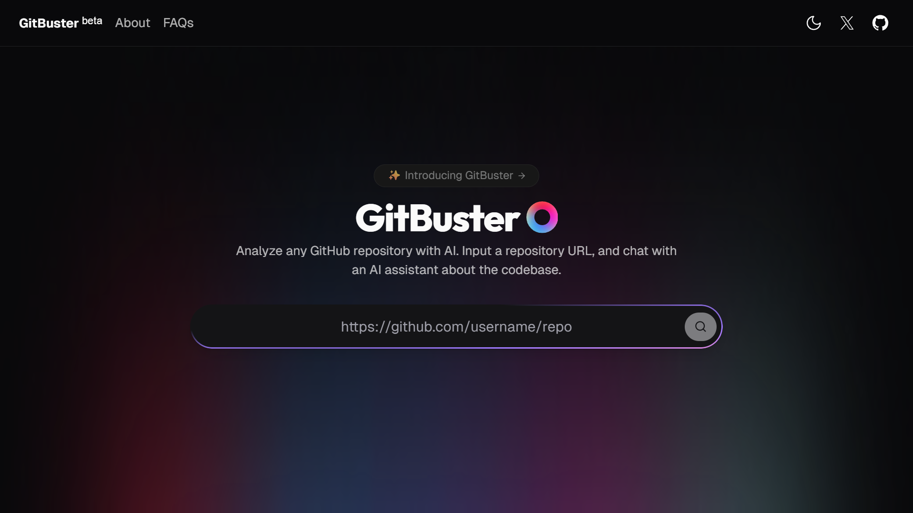

<div align="center">
  <h1>GitBuster</h1>
  <p><strong>AI-Powered GitHub Repository Analyzer & Chat Assistant</strong></p>
  
  [](https://nextjs.org/)
  [](https://reactjs.org/)
  [](https://www.typescriptlang.org/)
  [](https://tailwindcss.com/)
  [](LICENSE)
  
  <p>
    <a href="#features">Features</a> •
    <a href="#demo">Demo</a> •
    <a href="#getting-started">Getting Started</a> •
    <a href="#tech-stack">Tech Stack</a> •
    <a href="#project-structure">Structure</a> •
    <a href="#contributing">Contributing</a>
  </p>
</div>

---



## About

**GitBuster** is an intelligent GitHub repository analyzer that leverages AI to help developers understand codebases faster. Simply paste a GitHub repository URL, and GitBuster will analyze the entire codebase, providing interactive visualizations, dependency graphs, and an AI-powered chat interface to answer questions about the code.

Perfect for:

- **Code Review**: Quickly understand new repositories
- **Learning**: Explore open-source projects with AI guidance
- **Onboarding**: Help new team members navigate large codebases
- **Development**: Get instant answers about project structure and implementation

## Features

### Core Features

- **AI Chat Assistant**: Ask questions about any part of the codebase and get intelligent responses
- **Repository Visualization**: Interactive 3D visualization of repository structure using D3.js
- **Dependency Graph**: Visualize project dependencies and their relationships
- **Folder Structure Explorer**: Browse files and folders with search functionality
- **Code Highlighting**: Syntax-highlighted code blocks with copy-to-clipboard
- **Quick Actions**: Pre-built prompts for common analysis tasks

### 🎨 User Experience

- **Dark/Light Mode**: Seamless theme switching with `next-themes`
- **Responsive Design**: Optimized for desktop, tablet, and mobile devices
- **Smooth Animations**: Framer Motion powered transitions
- **Loading States**: Beautiful loading animations during analysis
- **Error Handling**: Graceful error messages and fallbacks

### 🔒 Additional Features

- **Privacy First**: Clear terms of service and privacy policy
- **Health Check**: Monitor backend service status
- **FAQ Section**: Comprehensive answers to common questions
- **Cookie Policy**: Transparent data usage information

## Getting Started

### Prerequisites

- **Node.js** 18.x or higher
- **npm** or **yarn** or **pnpm**
- **Git**

### Installation

1. **Clone the repository**

   ```bash
   git clone https://github.com/ateendra24/gitbuster.git
   cd gitbuster
   ```

2. **Install dependencies**

   ```bash
   npm install
   # or
   yarn install
   # or
   pnpm install
   ```

3. **Set up environment variables**

   Create a `.env.local` file in the root directory:

   ```env
   # Add your environment variables here
   NEXT_PUBLIC_API_URL=your_backend_api_url
   ```

4. **Run the development server**

   ```bash
   npm run dev
   # or
   yarn dev
   # or
   pnpm dev
   ```

5. **Open your browser**

   Navigate to [http://localhost:3000](http://localhost:3000)

### Build for Production

```bash
npm run build
npm run start
```

## Tech Stack

### Frontend Framework

- **[Next.js 15.3](https://nextjs.org/)** - React framework with App Router
- **[React 19](https://reactjs.org/)** - UI library
- **[TypeScript 5](https://www.typescriptlang.org/)** - Type safety

### Styling & UI

- **[Tailwind CSS 4](https://tailwindcss.com/)** - Utility-first CSS
- **[shadcn/ui](https://ui.shadcn.com/)** - Component library
- **[Radix UI](https://www.radix-ui.com/)** - Headless UI primitives
- **[Framer Motion](https://www.framer.com/motion/)** - Animation library
- **[Lucide React](https://lucide.dev/)** - Icon library

### Data Visualization

- **[D3.js](https://d3js.org/)** - Data visualization
- **[React Syntax Highlighter](https://github.com/react-syntax-highlighter/react-syntax-highlighter)** - Code highlighting

### State & Data Fetching

- **[Axios](https://axios-http.com/)** - HTTP client
- **[React Use](https://github.com/streamich/react-use)** - React hooks library

### Development Tools

- **[ESLint](https://eslint.org/)** - Code linting
- **[TypeScript ESLint](https://typescript-eslint.io/)** - TypeScript linting
- **[PostCSS](https://postcss.org/)** - CSS processing

## Project Structure

```
front/
├── src/
│   ├── app/                      # Next.js App Router pages
│   │   ├── (routes)/             # Route groups
│   │   │   ├── [username]/[repo]/ # Dynamic repo page
│   │   │   ├── about/            # About page
│   │   │   ├── faq/              # FAQ page
│   │   │   ├── health/           # Health check page
│   │   │   ├── privacy/          # Privacy policy
│   │   │   ├── terms/            # Terms of service
│   │   │   └── cookies/          # Cookie policy
│   │   ├── home/                 # Home page
│   │   ├── layout.tsx            # Root layout
│   │   ├── page.tsx              # Landing page
│   │   └── globals.css           # Global styles
│   │
│   ├── components/               # Reusable components
│   │   ├── ui/                   # shadcn/ui components
│   │   ├── magicui/              # Custom UI components
│   │   ├── layout/               # Layout components
│   │   │   ├── BaseNavbar.tsx
│   │   │   ├── Footer.tsx
│   │   │   ├── Navbar.tsx
│   │   │   └── RepoPageNavbar.tsx
│   │   ├── icons/                # Icon components
│   │   ├── pages/                # Page-specific components
│   │   └── Wrappers/             # Layout wrappers
│   │
│   ├── containers/               # Page containers
│   │   ├── aboutpage/            # About page sections
│   │   ├── homepage/             # Home page sections
│   │   ├── repopage/             # Repository page sections
│   │   ├── faq-page/             # FAQ sections
│   │   └── [policy-pages]/       # Policy page sections
│   │
│   ├── config/                   # Configuration files
│   │   └── siteConfig.js         # Site configuration
│   │
│   ├── lib/                      # Utility functions
│   │   └── utils.ts              # Helper utilities
│   │
│   ├── hooks/                    # Custom React hooks
│   │   └── use-mobile.ts         # Mobile detection hook
│   │
│   └── types/                    # TypeScript type definitions
│       └── repo.ts               # Repository types
│
├── public/                       # Static assets
├── pages/                        # API routes
│   └── api/
│       ├── chat.js               # Chat API endpoint
│       ├── health.js             # Health check endpoint
│       └── process-repo.js       # Repository processing endpoint
│
├── components.json               # shadcn/ui configuration
├── next.config.ts                # Next.js configuration
├── tailwind.config.ts            # Tailwind CSS configuration
├── tsconfig.json                 # TypeScript configuration
└── package.json                  # Dependencies
```

## Architecture

### Feature-Based Organization

The project follows a **feature-based architecture** where components are organized by their purpose:

- **`/app`**: Next.js 15 App Router with file-based routing
- **`/components`**: Shared, reusable UI components
- **`/containers`**: Page-level containers that compose components
- **`/features`**: Feature-specific logic and components (planned)
- **`/lib`**: Utility functions and helpers
- **`/hooks`**: Custom React hooks for shared logic
- **`/types`**: TypeScript type definitions

### Key Design Patterns

- **Component Composition**: Small, focused components composed into larger features
- **Separation of Concerns**: UI, business logic, and data fetching separated
- **Type Safety**: Comprehensive TypeScript coverage
- **Responsive Design**: Mobile-first approach with Tailwind CSS
- **Accessibility**: ARIA labels and keyboard navigation support

## Key Components

### Repository Analysis

- **`RepoVisualizer`**: 3D visualization of repository structure
- **`DependencyGraph`**: Interactive dependency relationship graph
- **`FolderStructure`**: File browser with search functionality
- **`Details`**: Repository metadata and statistics

### Chat Interface

- **`Chat`**: AI-powered chat interface
- **`CodeBlock`**: Syntax-highlighted code display
- **`QuickActions`**: Pre-built analysis prompts
- **`SummaryInterface`**: Repository summary display

### Layout

- **`BaseNavbar`**: Main navigation with theme toggle
- **`RepoPageNavbar`**: Repository-specific navigation
- **`Footer`**: Site footer with links
- **`PageWrapper`**: Consistent page layout wrapper

## Contributing

Contributions are welcome! Please follow these steps:

1. **Fork the repository**
2. **Create a feature branch**
   ```bash
   git checkout -b feature/amazing-feature
   ```
3. **Commit your changes**
   ```bash
   git commit -m 'Add amazing feature'
   ```
4. **Push to the branch**
   ```bash
   git push origin feature/amazing-feature
   ```
5. **Open a Pull Request**

### Development Guidelines

- Follow the existing code style and structure
- Write meaningful commit messages
- Add TypeScript types for new code
- Test thoroughly before submitting
- Update documentation as needed

## License

This project is licensed under the **MIT License** - see the [LICENSE](LICENSE) file for details.

## Author

**Ateendra**

- Twitter: [@ateendra24](https://x.com/ateendra24)
- GitHub: [@ateendra24](https://github.com/ateendra24)
- LinkedIn: [ateendra24](https://www.linkedin.com/in/ateendra24)

## Acknowledgments

- [Next.js](https://nextjs.org/) for the amazing framework
- [Vercel](https://vercel.com/) for hosting and deployment
- [shadcn/ui](https://ui.shadcn.com/) for beautiful components
- [D3.js](https://d3js.org/) for powerful visualizations
- All open-source contributors

## Contact & Support

- **Feedback**: [Submit feedback](https://forms.gle/c97P7ov41tSL9nom8)
- **Issues**: [GitHub Issues](https://github.com/ateendra24/gitbuster/issues)
- **Discussions**: [GitHub Discussions](https://github.com/ateendra24/gitbuster/discussions)

---

<div align="center">
  <p>Made by <a href="https://github.com/ateendra24">Ateendra</a></p>
  <p>Star this repo if you find it helpful</p>
</div>
